# Fountain Codes: a way to reduce blockchain storage costs

My name is Lucas Lima, and over the past few months I have been conducting research with Prof. Edil Medeiros in the area of Fountain Codes applied to Bitcoin, as suggested by [Olaoluwa Osuntokun](https://x.com/roasbeef/status/1973914845247594840). Thanks Vinteum for sponsoring this work through the fellowship program.


## Introduction

At the time of writing, the Bitcoin blockchain already exceeds 740 GB of storage. This continuous growth in blockchain size represents a challenge for running full nodes, since maintaining a complete copy of the history requires increasingly more disk space and computational resources, raising the operational cost of those nodes.

As an alternative, many users choose to run pruned nodes, which fully validate blocks and transactions but discard older parts of the blockchain after validation, keeping only the most recent data needed for the node to function. However, pruned nodes can't contribute to the Initial Block Download (IBD) for bootstrapping nodes.

The proposal of the Fountain Codes-based architecture is to allow pruned nodes to help the network serve historical block data without imposing too much a storage overhead on them. This is achieved by dividing the blockchain into fixed-size periods, where each division is called an epoch, and then encoding each of those epochs. The technique is randomized and doesn't require coordination among peers.
Nodes following this architecture would no longer store the entire blockchain, but rather these encodings, referred to as droplets, along with block headers. When a new node following the architecture joins the network, it can reconstruct blockchain epochs by collecting enough droplets, and also verify the validity of the encoded droplets. There are no additional trust assumptions on top of the existing Bitcoin protocol.


## Fountain Codes architecture

The architecture presented is based on the paper [[1]](#references), which uses **Luby Transform Code** (LT Code), a family of Fountain Codes. The core idea of this type of code is to transform a set of `k` original blocks into a potentially large number of encoded blocks, which we call droplets. Each droplet is generated by selecting some original blocks according to a degree distribution and combining those blocks with XOR.


Within this architecture, we can have three kinds of nodes on the network:

1. **Droplet nodes**: nodes that have already validated blocks but no longer store the entire original blockchain. Instead, they keep block headers and a set of droplets for each epoch.
2. **Bucket nodes**: nodes in the bootstrapping process. They collect droplets from droplet nodes, organize data by epoch, and run the decoding process to reconstruct the original blocks. After recovering and validating the blockchain, a bucket node can act as a droplet node or a full node.
3. **Murky Nodes**: malicious nodes that distribute corrupted droplets (*murky droplets*) to hinder epoch reconstruction. During bootstrap, the bucket node detects these droplets by checking whether there is a match between the header and the Merkle root of each singleton against the header-chain, rejecting the invalid ones.

As a result, reconstruction does not depend on receiving specific droplets. The bucket node only needs to collect a sufficient number of honest droplets for the decoding process to recover the original blocks. LT Codes allow different nodes to store different droplets for the same epoch, and a new node can recover the blockchain by combining data received from multiple sources. Additionally, since epochs are independently encoded, a droplet node can download droplets in parallel and unencoded blocks from full nodes.

### Encoding

The encoding process is the step in which a node transforms already-validated blockchain blocks into droplets. The idea is that the node does not encode the entire blockchain at once, but rather in epochs. An epoch is defined as the period needed for the blockchain to grow by `k` blocks. For example, if `k = 1000`, then each group of 1000 blocks forms an epoch.

When an epoch ends, the node takes the sub-chain corresponding to those `k` blocks and generates `s` droplets from it. Each droplet is an encoded chunk, produced through combinations of some of the original blocks from that epoch. After generating these droplets, the node can discard the original blocks from that epoch and keep only the corresponding droplets, saving space.

Step-by-step of the encoding process:

1. The node selects an epoch, i.e., a set of `k` already-validated blocks: `B1, B2, ..., Bk`.
2. To generate a droplet `Cj`, the node draws a degree `d` between `1` and `k`, following a probability distribution defined by the code.
3. Then, the node randomly selects `d` distinct blocks within that epoch. These blocks are called the neighbors of the droplet.
4. The content of the droplet is computed by taking the bitwise XOR of those `d` blocks:

```text
Cj = Bi_1 XOR Bi_2 XOR ... XOR Bi_d, where Bi_x denotes one of the d selected blocks
```

5. Along with the droplet, the node stores a way to identify which blocks participated in the combination, i.e., which blocks were used to encode that droplet.
6. The process is repeated until the node generates `s` droplets for that epoch.
7. After that, the node can delete the `k` original blocks of that epoch and keep only the `s` droplets, the vectors indicating their neighbors, and the header-chain.


One important point is that this doesn't require pruned nodes to keep the full historical blockchain or introduce any additional security assumption. Pruned nodes already store the full header chain and also a window of recent full blocks to handle possible chain reorganizations. The only additional storage required by this scheme is the encoded droplets.


### Decoding

The decoding process occurs when a new node wants to recover the blockchain from the droplets stored by other nodes. This new node is called a bucket node in the paper, because it works like a bucket collecting drops from the fountain. It contacts several droplet nodes and downloads droplets for each blockchain epoch.

For each epoch, the bucket node needs to collect enough droplets to reconstruct the `k` original blocks of that sub-chain. Because the droplets were created with Fountain Codes, the node does not need to receive specific droplets from specific nodes: in principle, any sufficiently large set of honest droplets can allow reconstruction. This is one of the useful properties of this architecture, because it avoids depending on a specific archival node.

After collecting the droplets, the node runs the decoding algorithm to recover the original blocks of each epoch. This reconstruction also uses the blockchain headers to verify that the recovered blocks match the Merkle roots present in the headers and to identify malicious droplets, called murky droplets in the paper. Thus, decoding does not only serve to reconstruct the data, but also to filter out invalid contributions from adversarial nodes.

Step-by-step of the decoding process:

1. The bucket node downloads droplets from several droplet nodes for the same epoch. If it contacts `n` nodes and each one stores `s` droplets per epoch, then it will have up to `n * s` droplets to attempt reconstructing the `k` original blocks.
2. To generate a droplet `Cj`, the node draws a degree `d` between `1` and `k`, following a given probability distribution.
3. Each droplet is connected to the blocks that participated in its creation. This information comes from the vector `vj` associated with the droplet.
4. The algorithm looks for a droplet connected to only one still-unknown block. This type of droplet is called a `singleton`.
5. If no singleton exists, the algorithm cannot advance with the current set of droplets. To continue, the node must download additional droplets for that epoch from other nodes and retake the decoding process.
6. If a singleton exists, the algorithm treats the content of that droplet as a candidate for the corresponding original block.
7. Before accepting the block, a verification is performed to check whether it is consistent with the header chain. To do this, the expected header and the Merkle root computed from the block payload are compared with the Merkle root stored in the true header.
8. If the verification fails, the droplet is considered malicious or invalid, and is removed from the graph.
9. If the verification passes, the block is accepted as recovered.
10. Once a block is recovered, the algorithm removes its contribution from the other droplets that depended on that block. This is done by applying XOR again:

```text
new_droplet = current_droplet XOR recovered_block
```

11. Next, the edges linked to the recovered block are removed from the graph.
12. This process repeats: find singletons, verify, accept or reject, remove contributions, and update the graph.
13. Decoding succeeds when all `k` blocks of the epoch have been recovered. If at any point there are no more singletons and unknown blocks still remain, decoding can't proceed and the node needs to collect more droplets.

When the bucket node finishes the reconstruction, it validates the recovered blocks. After that, it can also encode the blockchain into droplets and immediately start acting as a droplet node for that epoch of the blockchain, contributing to the bootstrapping of other nodes.

With this, the minimum number of honest nodes to connect to so that droplet collection succeeds with probability at least `1 - delta` is given by:

```text
(1 / s) * (k + O(sqrt(k) * ln^2(k / delta)))
```


### Robust Soliton Distribution

In the encoding step, each droplet needs to choose a degree `d`, i.e., how many original blocks will be combined to form that droplet. A droplet with degree `1` contains only one original block and is called a singleton. A droplet with high degree contains the XOR of many original blocks and  depends on many blocks at the same time. 
This choice should not be completely uniform. If many droplets have high degree, the decoder will have difficulty finding singletons at the start. If many droplets have  low degree, they may not carry enough independent information to reconstruct all blocks. The `Robust Soliton Distribution` is the distribution used to balance these two effects.

The intuition is to create droplets with varied degrees, but maintaining enough low-degree droplets to feed the peeling decoder. The decoder depends on singletons to start and continue reconstruction. Every time a block is recovered, its contribution is removed from the other droplets. When enough of a high-degree droplet's neighbors have already been recovered, that droplet can eventually become a new singleton. Therefore, the degree distribution needs to keep this process alive until all `k` blocks of the epoch are recovered.

First, the `Ideal Soliton Distribution` is presented, defined as:

```text
rho(1) = 1 / k
rho(d) = 1 / (d * (d - 1)), for  1 < d <= k
```

| k = 10 | k = 100 |
| :---: | :---: |
| 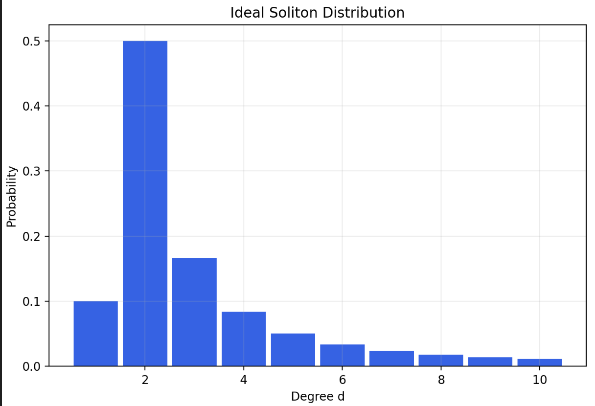 | 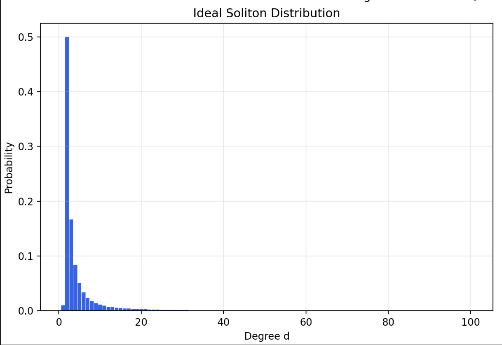| 


This distribution has an interesting theoretical property: on average, it tends to keep the peeling process going with approximately one singleton available per iteration. The problem is that this is fragile. In practice, if at any point the decoder runs out of singletons, the process stops, even if there are still useful droplets in the graph.

To make this more robust, the `Robust Soliton Distribution` adds a correction `theta(d)` to the ideal distribution. This correction increases the probability of certain degrees, especially lower ones, to reduce the chance of the decoder running out of singletons during reconstruction.

For parameters `0 < delta < 1` and `c > 0`, define:

```text
R = c * sqrt(k) * ln(k / delta)
```

Then, define the auxiliary function `theta(d)`:

```text
theta(d) = R / (d * k),              for 1 <= d <= k/R - 1

theta(d) = (R / k) * ln(R / delta),  for d = k/R

theta(d) = 0,                        for d = k/R + 1 <= d <= k
```

The final distribution is obtained by summing the ideal distribution with this correction and normalizing:

```text
mu(d) = (rho(d) + theta(d)) / beta
```

where:

```text
beta = sum(rho(d) + theta(d)), for 1 <= d <= k
```
| k = 10 | k = 100 |
| :---: | :---: |
| 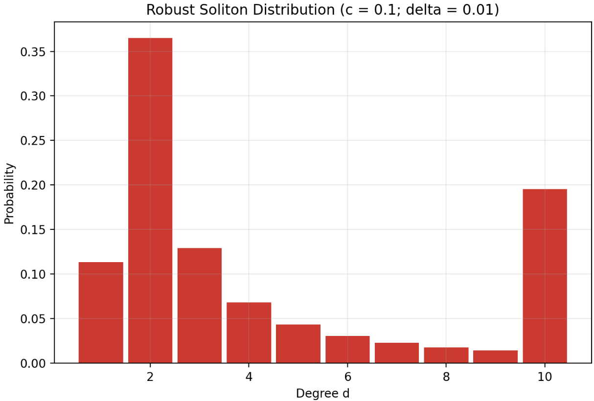 |  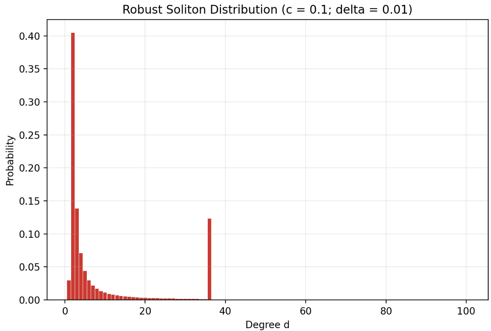| 


In practice, `mu(d)` is the function the encoder uses to draw the droplet degree. That is, when the node is about to generate a new droplet, it draws `d` according to `mu(d)`, picks `d` random blocks from the epoch, and computes the XOR among them. The parameters play the following roles:

1. `k` is the number of blocks in the epoch.
2. `d` is the degree of a droplet, i.e., how many blocks enter that XOR.
3. `R` controls the size of the robustness "reserve" added to the ideal distribution.
4. `delta` controls an estimate of the probability of decoding failure.
5. `c` is a tunable parameter used to calibrate how many extra droplets will be needed in practice, directly proportional to the value of `R`. This makes the distribution add more probability mass, especially at low degrees and at the special degree near k / R.

The expected result is that the bucket node needs to collect only slightly more than `k` honest droplets to reconstruct the `k` original blocks with high probability. This is the reason the distribution matters: it does not change the basic operation of XOR, but it changes the probability that the graph generated by encoding is easy to decode by the peeling decoder.


### Step-By-Step in a toy example

Let there be an epoch with 6 blocks: `B1, B2, B3, B4, B5, B6`

In this example, consider 3 nodes, each storing 3 droplets for this epoch, with one of them being a murky node that will propagate some malicious droplets.

I will mark murky droplets with red letters. To indicate a step of `peeling decoding`, discarded droplets will be marked with a red circle over them, edges of singleton droplets to be selected in the iteration will be marked in orange, and the other droplets to be updated in that iteration will be marked with a green edge.

So, a bucket node would collect 9 droplets, with each droplet encoded as follows:

- Node 1:

        - C1: B3 XOR B5 XOR B6
        - C2: B1 XOR B4
        - C3: B3 

- Node 2:

        - C4: B1 XOR B6
        - C5: B2 XOR B5 XOR B6 
        - C6: B3 XOR B6  
  
- Node 3 (murky node):

        - C7 (murky droplet): B1 XOR B2 XOR B3
        - C8 (murky droplet): B3 XOR B6
        - C9: B2 XOR B4


So, upon collecting these droplets, it will begin decoding as follows:

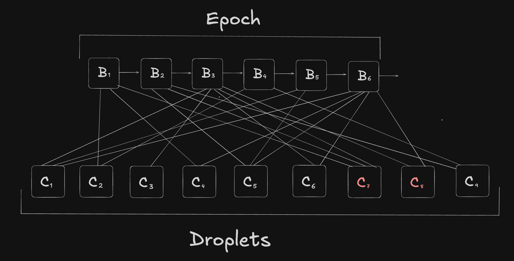


Then, the only singleton droplet (a degree-1 droplet — i.e., connected to a single block) is droplet **C3**, which is connected to block **B3**. Since **C3** is an honest droplet, it will be considered valid when verified against **B3**'s header. After that, for each droplet C_i connected to block B3, the following update operation will be performed:

C_i = C_i XOR C3

In this case, the droplets to be updated are C1, C6, C7, and C8 (with green edges in the image), and the connection between droplet C3 and B3 (orange edge) will also be removed.

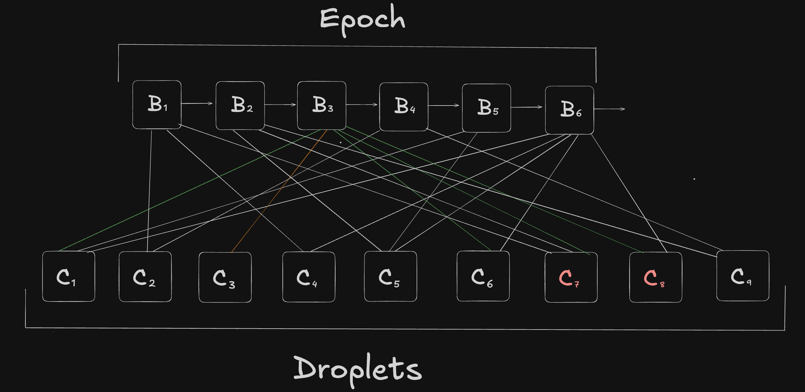


Then, in the next iteration, the singleton droplets will be **C6** and **C8**. Suppose that droplet **C8** is selected for the next decoding iteration.

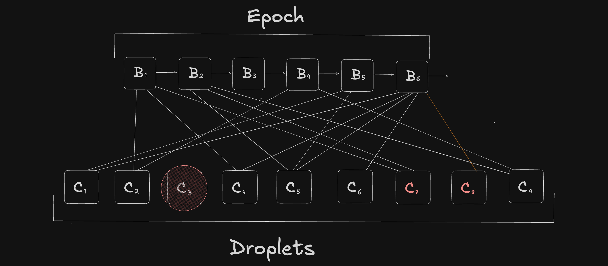

However, **C8** is a murky droplet, which will cause the verification against the header and the Merkle root to fail. Therefore, droplet **C8** will simply be discarded, without performing any XOR operation with another droplet.

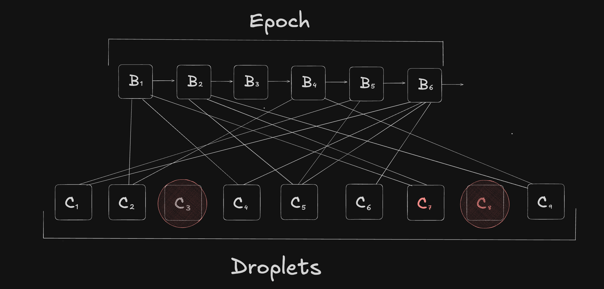


Then, droplet **C6** will be selected in the next iteration, which is adjacent to block **B6**. Besides it, the other adjacent droplets are: C1, C4, and C5.


After the third iteration, the bipartite graph will look like the following image.


Then, the next singleton droplet to be selected will be **C4**, adjacent to block **B1**. The other droplets to be updated will be C2 and C7.


In the next step, suppose the singleton to be selected is **C7**, which is adjacent to **B2**. However, it will fail validation against the header-chain and the Merkle root, so it will simply be discarded without updating any other droplet.

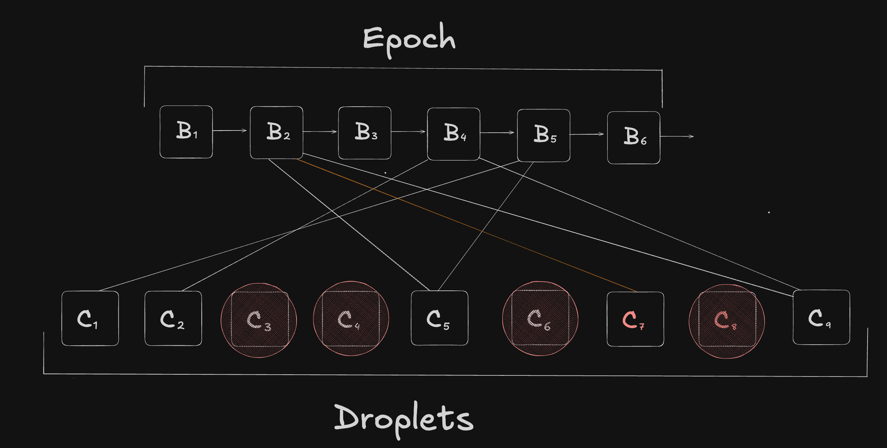

After the updates, we will have the following state:

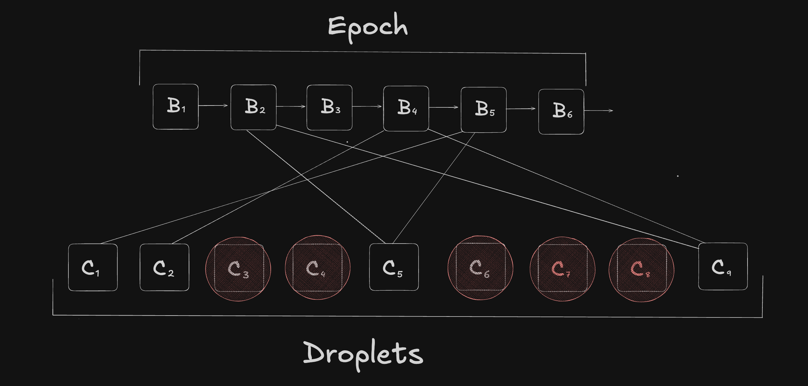


In the next iteration, suppose droplet **C2** is selected, which is adjacent to block **B4**. Besides **C2**, another droplet adjacent to the block is **C9**.

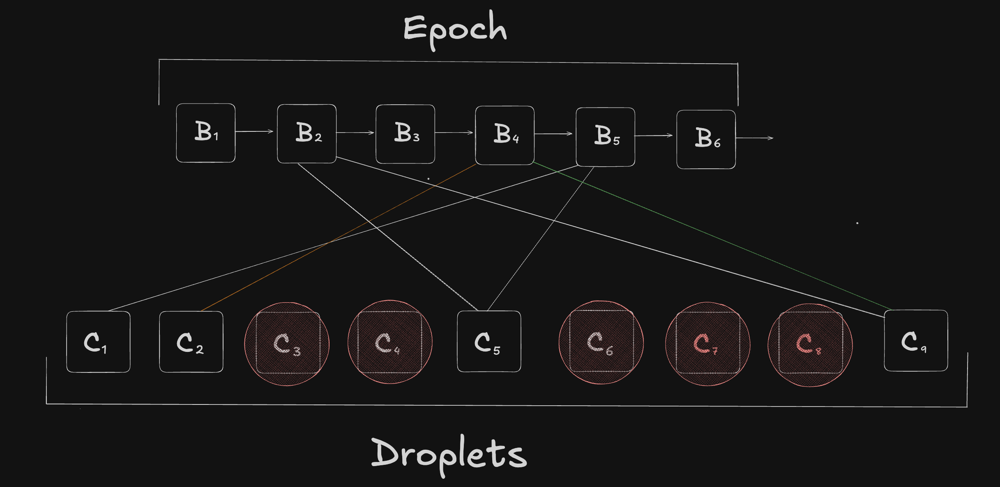

After the updates, we will have the following state:

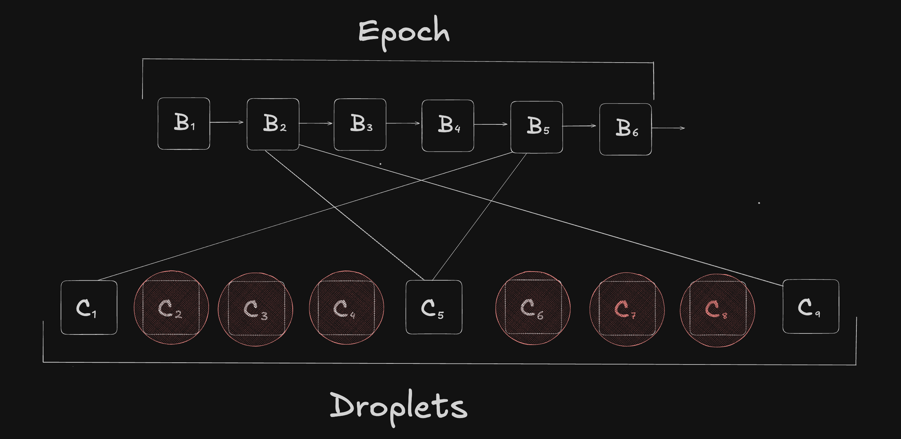


In the seventh iteration, the selected droplet will be **C9**, which is adjacent to block **B2**. The droplets to be updated will be C5 and C9, allowing block B2 to be recovered.

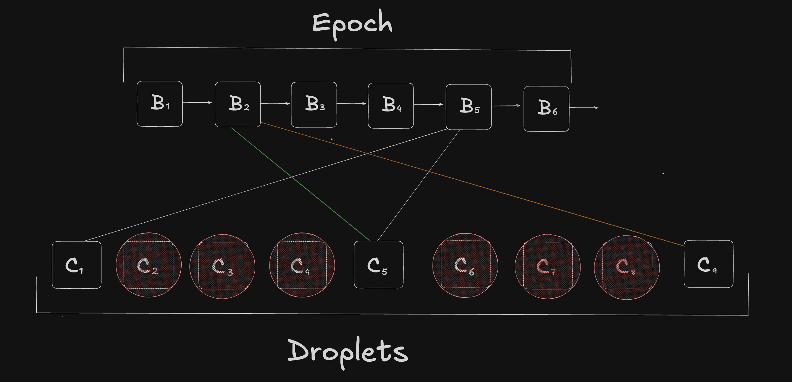

After the updates, we will have the following state:

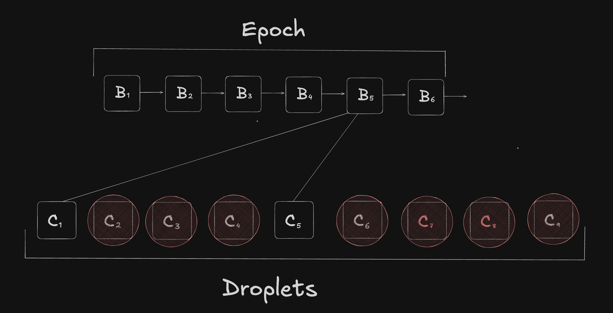

In the eighth iteration, the selected droplet will be **C5**, which is adjacent to block **B5**. Since C1 is also a singleton droplet adjacent to B5, it does not need to be updated — it can simply be discarded. Then, block B5, which was the last block to be recovered for this epoch, will be recovered.

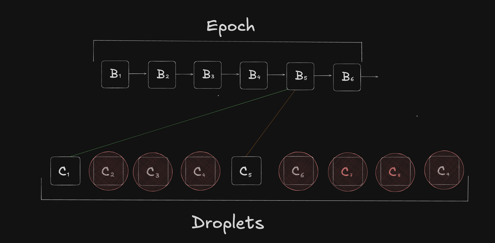

After this process, the epoch will be completely reconstructed:

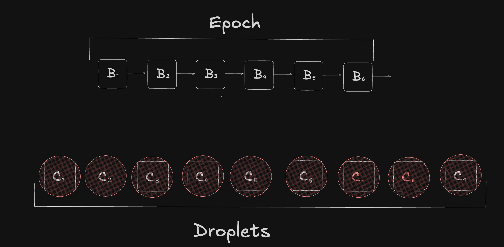


## Simulations


### Bootstrap cost versus storage savings

An experiment measures the bootstrap cost. The bootstrap cost is the number of honest droplet nodes a new node needs to contact in order to successfully reconstruct the blockchain. Here, `gamma` is the storage savings factor, a droplet node stores `1/gamma` of the total blockchain size, meaning it uses `gamma` times less storage than a full archival node. There is a simple theoretical lower bound: if each node stores only `1/gamma` of the blockchain, then a new node needs to contact at least `gamma` honest nodes, because it needs to download, in total, enough data to reconstruct the entire blockchain.

The paper [[1]](#references) compares this optimal lower bound with the performance of Fountain Codes.

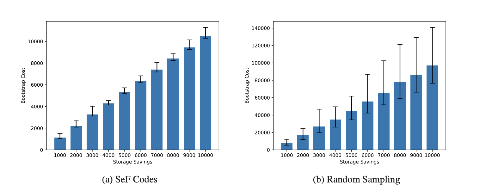

On the `x` axis we have the storage savings factor `gamma`, i.e., a node stores `1/gamma` of the blockchain. On the `y` axis we have the number of nodes needed to successfully bootstrap.

The graph shows the average bootstrap cost as a function of storage savings. The Fountain Codes curve stays much closer to the optimal lower bound than the random sampling strategy, where each node keeps random blocks without using encoding.

Another aspect is that the random sampling also exhibits much higher variance in the number of nodes needed. In practice, the bootstrap cost becomes more unpredictable and individual nodes may need to contact more peers than expected. With Fountain Codes, the variance stays lower, making the reconstruction process more reliable.

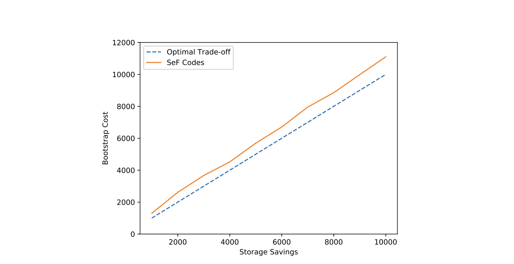

The graph shows the bootstrap cost needed to recover the blockchain with `99%` success. In summary, the greater the storage savings, the more nodes need to be contacted, but this increase stays close to the theoretically necessary minimum.

### Producer-Consumer experiment

In this experiment, I simulated a bucket node (consumer) trying to reconstruct an epoch by collecting random droplets. There is another simulated node (producer) that produces droplets for that epoch and sends them to the consumer.

For each configuration of `c` and `delta` (in the Robust Soliton Distribution), I repeated the experiment 100 times to see how many droplets are needed for epoch reconstruction.

See references [[8]](#references) for the blockchain I used as the epoch for this test.

#### Results

- {c = 0.1, delta = 0.05}


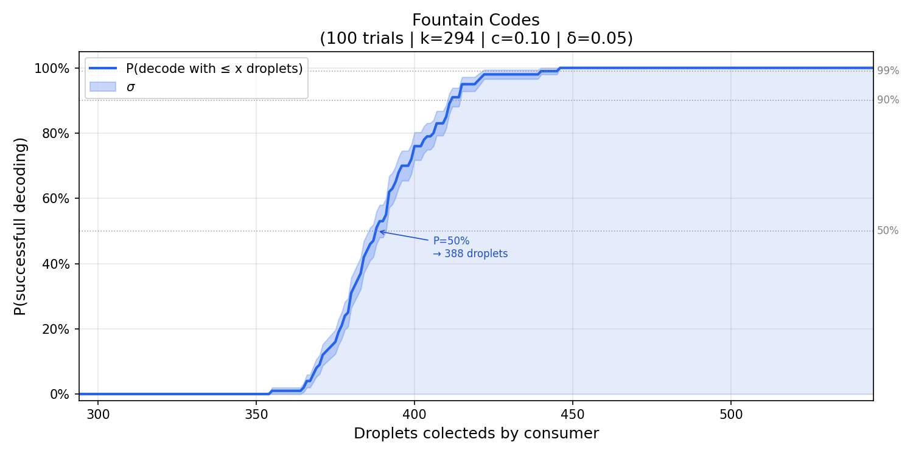

- {c = 0.3, delta = 0.05}


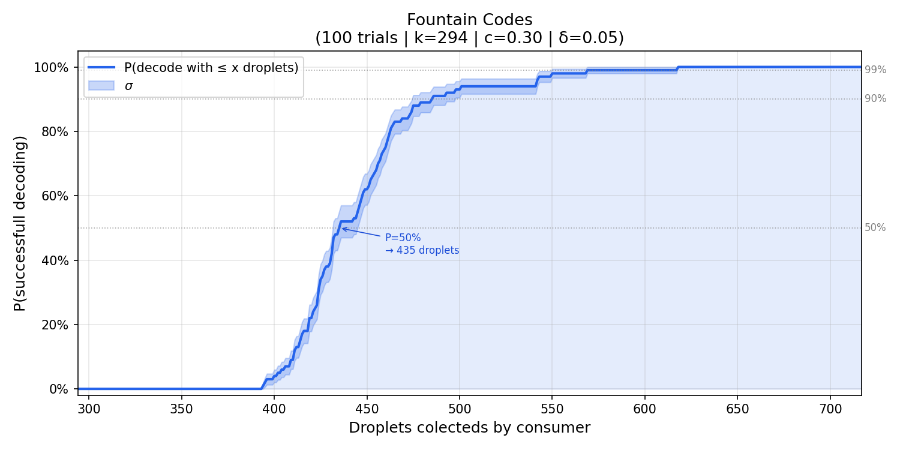

- {c = 0.1, delta = 0.01}


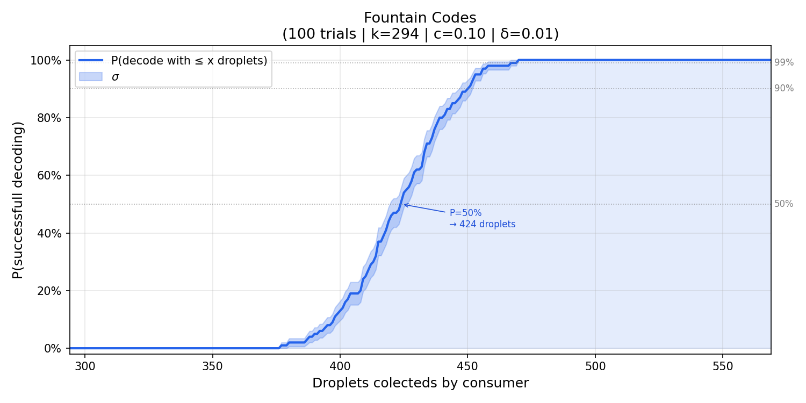

- {c = 0.3, delta = 0.01}
  

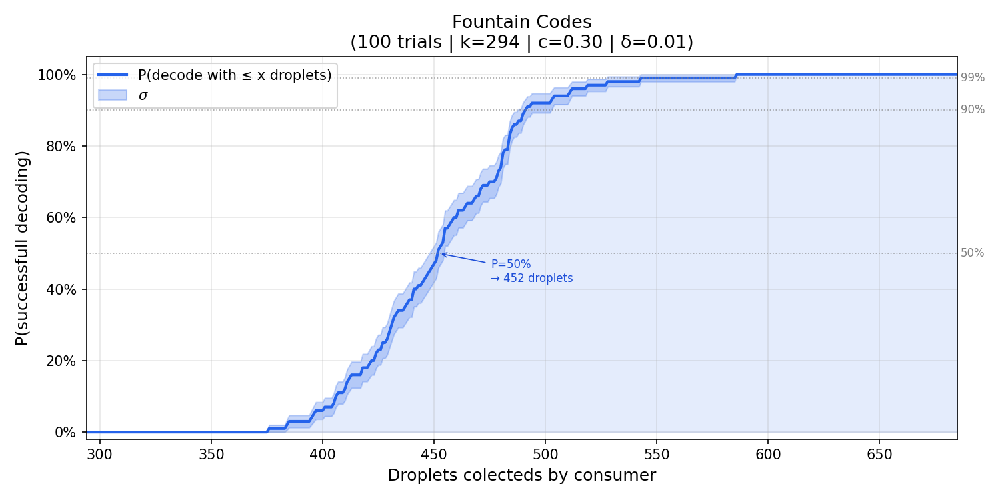


Based on the graphs above, it's possible to notice:

- **`delta`**: comparing configurations with the same `c` but different `delta` values, reducing `delta` from `0.05` to `0.01` shifts the histogram slightly to the right, that is, slightly more droplets are needed on average. This is expected, since a smaller `delta` makes the distribution more conservative, adding more probability mass at lower degrees to reduce the chance of the decoder stalling.

- **`c`**: comparing configurations with the same `delta` but different `c` values, increasing `c` from `0.1` to `0.3` produces a more concentrated histogram. The variance decreases, meaning the number of droplets required becomes more predictable across runs. This happens because a larger `c` increases `R`, which strengthens the robustness correction, keeping the peeling decoder fed with singletons more consistently.

The configuration `{c = 0.3, delta = 0.05}` achieves a good balance, the overhead above `k` stays low and the variance is small, making reconstruction both efficient and predictable.


## Open problems


### Define values of k, s, c, and delta

An important decision for the PoC is to choose initial values for `k`, `s`, `c`, and `delta`.

A larger `k` (epoch size) tends to improve the efficiency of Fountain Codes, bringing the bootstrap cost closer to the optimal lower bound. On the other hand, a larger `k` also requires the node to buffer more data before closing the epoch and generating the encoding. For Bitcoin, `k = 1000` represents approximately one week of blocks, considering one block every ten minutes.

The value of `s`, the number of droplets stored per epoch by each node, can be left as a configurable parameter. A smaller `s` gives the node greater storage savings, while a larger `s` makes the node contribute more data to the bootstrap process of other nodes. Users with less available storage can store fewer droplets per epoch, while users who want to contribute more to the network can choose a larger value.

So, if we choose `k = 1000` and `s = 10`, the target is approximately `100x` storage savings.

The parameters `c` and `delta` enter the Robust Soliton Distribution. 
`delta` represents an estimate of the tolerated failure probability in decoding: smaller values require more robustness and tend to increase the number of droplets needed. 
`c` controls the extra robustness term of the distribution: larger values help keep singletons available during the peeling decoder, but may also increase overhead.

For an initial PoC, I would use the configuration:

        `k = 1000`, `s = 10`, `c = 0.3`, `delta = 0.05`

accepting a smaller savings of approximately `100x`.


### Evaluate alternative degree distributions

Another open question is whether the Robust Soliton Distribution is the best choice for this architecture, or whether other probability distributions could produce more favorable numbers in practice. The distribution directly affects how many droplets need to be collected, how often the peeling decoder gets stuck, and how much overhead is needed beyond the original `k` blocks. In particular, it would be interesting to compare Robust Soliton against exponential distributions for the droplet degrees. 


### Define protocol changes to support Fountain Codes

For this architecture to work in a real implementation, it would also be necessary to define how nodes announce support for Fountain Codes, how they discover available droplets, and how they exchange that data over the network, while maintaining compatibility with other nodes. Among the main protocol topics to be defined in the spec, I see:

1. **Support signaling**: the node needs to announce that it understands Fountain Codes, possibly through a new service flag in the handshake, such as `NODE_FOUNTAIN`. This way, compatible peers could activate specific messages for droplets. Another way to signal this capability would be through BIP-434.

2. **Peer messages**: the protocol needs to define messages for discovering, requesting, and sending droplets between peers. A bucket node must be able to query which epochs a peer has, discover which droplets are available, and request specific droplets or a number of droplets for an epoch. 
   
   These messages could follow a logic similar to `inv/getdata`, but oriented toward Fountain Codes, carrying fields such as `epoch_id`, droplet degree, and encoded payload. Ideally, the protocol would use deterministic seeds to derive the neighbors, avoiding the transmission of large vectors.

3. **Bootstrap flow**: the general flow would be: connect to peers, identify which ones support Fountain Codes, query available epochs, collect droplets from multiple peers, run decoding, verify the reconstructed blocks against the header-chain, and request more droplets if decoding fails. 

    Even with `delta` being set to values that make the probability of successful decoding high, it is not possible to make this value 100% with Fountain Codes alone. For cases where decoding fails even after collecting droplets from all fountain nodes, having a fallback to request the blocks that were not reconstructed in the epoch could be a good option.

5. **Handling invalid droplets and the nodes that sent them**: the protocol also needs to define how to handle murky droplets. When a droplet produces an invalid candidate block, the node should discard that data and record the peer's behavior, potentially limiting new requests, disconnecting, or penalizing peers that repeatedly send invalid data.


## Next steps

As next steps, I am working on an initial PoC integrating Fountain Codes into `btcd`. The choice of `btcd` is interesting not only because it is a Go implementation, which aligns well with the current PoC, but also because it has been used as an experimentation platform for Utreexo, another less orthodox proposal that touches validation, storage assumptions, and P2P behavior. This makes `btcd` a good environment to test Fountain Codes before thinking about a more formal protocol proposal.

The first goal of this integration is to validate the basic flow within a real node: tracking new blocks, grouping blocks into epochs, generating droplets, persisting the necessary metadata, and allowing another node to reconstruct an epoch from the collected droplets.

After that, the next step is to create a test environment with multiple nodes to measure the behavior of the proposal under conditions closer to a real network.

With those results, the next step would be to mature a protocol specification and then think about the possible writing of a BIP.


****

## References

1. Swanand Kadhe, Jichan Chung, and Kannan Ramchandran. 2019. SeF: A Secure Fountain Architecture for Slashing Storage Costs in Blockchains. https://arxiv.org/pdf/1906.12140
2. Gauri Joshi, Joong Bum Rhim, John Sun and Da Wang. 2010. Fountain Codes. https://www.andrew.cmu.edu/user/gaurij/FountainCodes.pdf.
3. Changlin Yang, Kwan-Wu Chin, Jiguang Wang, Xiaodong Wang, Ying Liu, and Zibin Zheng. 2024. Scaling Blockchains with Error Correction Codes: A Survey on Coded Blockchains. ACM Comput. Surv. 56, 6, Article 139 (January 2024), 33 pages. https://doi.org/10.1145/3637224
4. Japneet Singh, Adrish Banerjee and Hamid Sadjadpour. 2022. Secure and Private Fountain Code based Architecture for Blockchains.
5. Qin Huang, Li Quan, and Shengli Zhang. 2022. Downsampling and Transparent Coding for Blockchain.
6. Aayush Tiwari, V. Lalitha. 2021. Secure Raptor Encoder and Decoder for Low Storage Blockchain.
7. Rudrashish Pal. 2020. Fountain Coding for Bootstrapping of the Blockchain.
8. Sample signet used on Producer-Consumer test: https://github.com/vinteum-bdl/infra-signet-server/tree/main/datadir_miner/signet
9. Fork of the Secure Fountain implementation (Fountain Codes using LT Codes): https://github.com/lucasdbr05/sef 
10. Roasbeef's (Olaoluwa Osuntokun) thread on X about Fountain Codes: https://x.com/roasbeef/status/1973914845247594840
